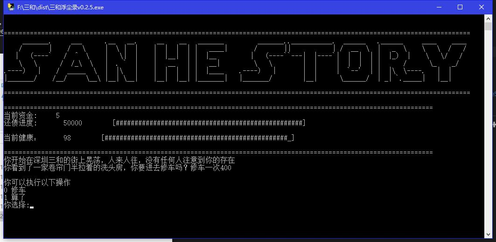

# 三和浮尘录

这是我在无聊过程中开发的游戏，希望能够展示三和大神的生活、困境和无奈
本人对三和大神的生活状态持批判态度，这个游戏本身非常严肃，只是看上去颇为戏剧化
希望每一个游玩本游戏的朋友，都不要走上三和大神的赌博之路

另外：戒赌吧已经被封，三和大神的故事真的如标题所言，成为了过气的浮尘，被遗忘在喧嚣的网络中
# 安装与运行
## 使用源码版本
环境：
python 3.5

下载源码之后，在根目录运行:
> python main.py
即可开始游戏

## 使用预编译版本
提供了Windows的预编译版本，请在这里查看：
https://github.com/ldl19691031/SanHeStory/releases

# 授权协议：BSD
* Copyright (c) 2018 著作权由ldl19691031所有。著作权人保留一切权利。
* 
* 这份授权条款，在使用者符合以下三条件的情形下，授予使用者使用及再散播本
* 软件包装原始码及二进位可执行形式的权利，无论此包装是否经改作皆然：
* 
* * 对于本软件源代码的再散播，必须保留上述的版权宣告、此三条件表列，以
*   及下述的免责声明。
* * 对于本套件二进位可执行形式的再散播，必须连带以文件以及／或者其他附
*   于散播包装中的媒介方式，重制上述之版权宣告、此三条件表列，以及下述
*   的免责声明。
* * 未获事前取得书面许可，不得使用作者或本软件贡献者之名称，
*   来为本软件之衍生物做任何表示支持、认可或推广、促销之行为。
* 
* 免责声明：本软件是由ldl19691031及本软件之贡献者以现状提供，
* 本软件包装不负任何明示或默示之担保责任，包括但不限于就适售性以及特定目
* 的的适用性为默示性担保。ldl19691031及本软件之贡献者，无论任何条件、
* 无论成因或任何责任主义、无论此责任为因合约关系、无过失责任主义或因非违
* 约之侵权（包括过失或其他原因等）而起，对于任何因使用本软件包装所产生的
* 任何直接性、间接性、偶发性、特殊性、惩罚性或任何结果的损害（包括但不限
* 于替代商品或劳务之购用、使用损失、资料损失、利益损失、业务中断等等），
* 不负任何责任，即在该种使用已获事前告知可能会造成此类损害的情形下亦然。